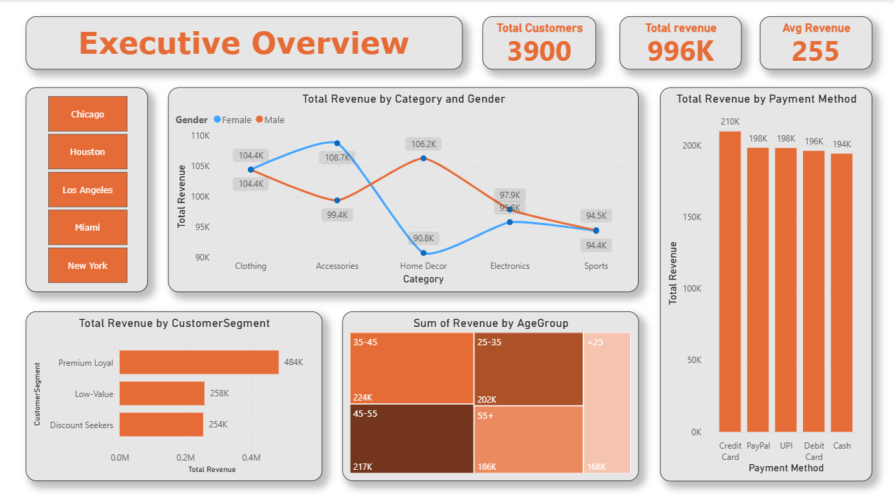
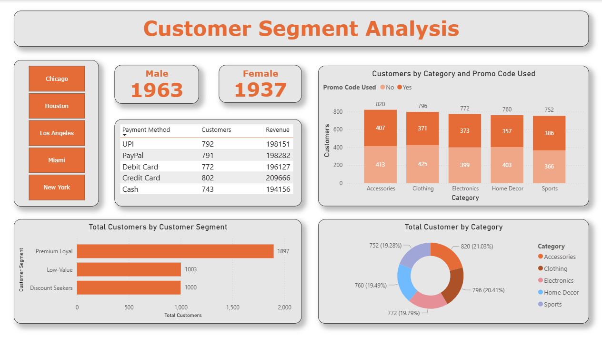
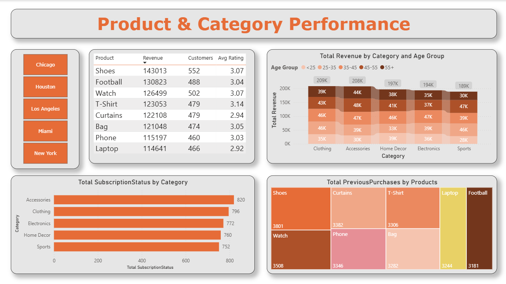
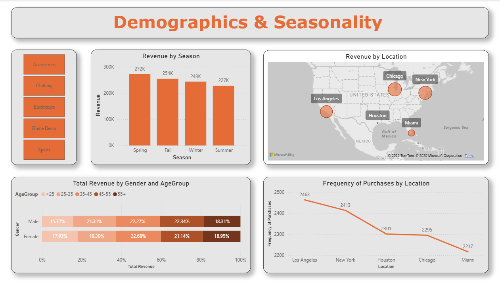

# Customer-Segmentatoin-Analysis
Customer segmentation analysis using Python, Excel, and Power BI to identify high-value customers and spending behavior for data-driven marketing decisions.  

## Objective
The objective of this project is to segment customers based on their purchasing behavior in order to identify high-value customer groups and generate actionable insights that support targeted marketing and data-driven business decisions.  

## Business Use Case
This analysis helps businesses improve customer targeting, optimize marketing campaigns, and increase customer lifetime value by understanding different customer segments and their spending patterns.  

## Dataset Used
-<a href="https://github.com/prayagsinojia-ops/Customer-Segmentatoin-Analysis/blob/main/final_customer_segmentation_with_clusters.csv">Dataset</a> 

This dataset was provided by Datamites™ as part of a data analytics training program. It contains transactional customer purchase data including demographic details, product categories, payment methods, location, and purchase amounts.

The dataset is designed for performing: 
-Customer segmentation analysis 
-Revenue analysis 
-Behavioral pattern identification 
-KPI development for business insights  

## Tools & Technologies
- Python
- Excel
- Power BI   

## Analysis Notebook
The customer segmentation and age group analysis were performed using a Jupyter notebook, which is included in the repository for reference.
 
<a href="https://github.com/prayagsinojia-ops/Customer-Segmentatoin-Analysis/blob/main/Clustering.ipynb">Analysis Noteboook</a> 

Performed Task: 

- Customer Data Preparation 
- Age Group Creation 
- Customer Segmentation (Clustering) 
- Segment-Level Insights  

## Dashboard
Interactive Power BI dashboards were created to visualize customer segments, spending behavior, and key performance indicators for business decision-making.

The project includes four interactive Power BI dashboards designed to support different business use cases:

- Executive Overview Dashboard
     

- Customer Behavior Dashboard  
     

- Product & category Performance Dashboard  
     

- Demographics & Seasonality Dashboard 
     

## Key Insights
- High-value customer segments contributed the majority of total revenue.
- Distinct customer groups exhibited different spending behaviors, enabling more effective and targeted marketing strategies.   

## Conclusion
This project demonstrates how customer segmentation and data analysis can be used to extract meaningful business insights that support strategic marketing and customer management decisions.   

## Contact
Prayag Sinojia  
data Analyst  
-<a href="https://www.linkedin.com/in/prayagsinojiya/">prayagsinojiya:- Linkdin</a> 
Cnatact No: 97231 00943 
Gmail: prayagsinojia@gmail.com   

